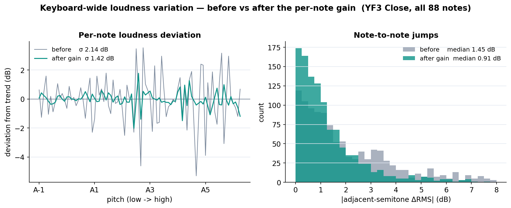
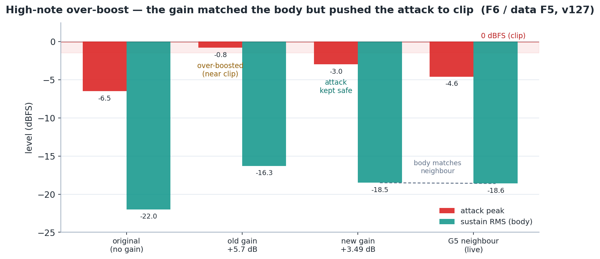
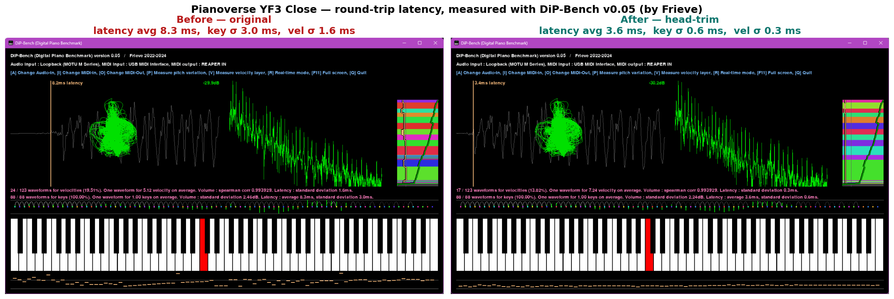

# Pianoverse Onset Fix


A tool that removes the ~8 ms note-onset delay baked into IK Multimedia **Pianoverse**'s
samples, and evens out its note-to-note volume — by editing the `.pak` sample containers
directly, leaving the plugin, presets, mic mixes and velocity mapping untouched.


Measured on the YF3 Close mic, the head-trim brings the onset delay from **9.3 ms down to
2.3 ms** (the aligned notes go from σ 9.0 ms to 0.27 ms), and the per-note volume pass cuts
the deviation from the keyboard's smooth loudness trend from **σ 2.14 dB to 1.42 dB**
(adjacent-semitone jumps: median 1.45 dB → 0.91 dB). Both YF3 mic positions (Close and
Coincident) have been processed this way.

**Intended use.** This is aimed at *playing* — trimming the dead head cuts the latency you feel while monitoring. Each mic position is processed independently (its own onset, aligned to the common preroll), so the positions come out onset-aligned rather than keeping their original inter-mic offset (the Coincident mic sits ~1.5 ms behind Close, from the extra distance). If you blend mic positions in a mix and want that spacing back, it's a one-track nudge in your DAW.

The bundled measurement CSVs (`data/`) and gain tables are from my YF3 run, kept as sample
data. Every one of them can be regenerated on your own copy with the included scripts —
see the [walkthrough](#walkthrough-processing-your-own-copy).

> **No Pianoverse sample audio is included in this repository** — only analysis code,
> measurements, and figures. You need your own licensed copy to use it. This is an
> interoperability / analysis project and is not affiliated with IK Multimedia; respect the
> terms of your own license/EULA.

## Contents

- [Background](#background)
- [What the delay actually is](#what-the-delay-actually-is)
- [The IKMPAK `.pak` format](#the-ikmpak-pak-format)
- [How the fix works](#how-the-fix-works)
- [Volume correction](#volume-correction)
- [Requirements](#requirements)
- [Walkthrough: processing your own copy](#walkthrough-processing-your-own-copy)
- [Other mic positions, other libraries](#other-mic-positions-other-libraries)
- [Results](#results)
- [Benchmark (DiP-Bench)](#benchmark-dip-bench)
- [Repository layout](#repository-layout)
- [Limitations](#limitations)
- [Disclaimer](#disclaimer)
- [License](#license)

## Background

Trigger a Pianoverse note with a fixed, mechanical key-press and there's still about 8 ms
between note-on and the note actually speaking. That delay is not audio-buffer or driver
latency — it is baked into the sample data itself.

Normally you would compensate for this inside the instrument, but Pianoverse exposes no
sample-start or playback-offset control (an amplitude attack envelope only shapes the volume;
it can't move the recorded content earlier). So it can't be fixed from the plugin UI.

The sample containers (`.pak`), however, are not encrypted and hold plain WAV audio. That
makes it possible to trim the dead head off each sample and write the container back, which
fixes the delay while keeping everything else about the instrument intact.

## What the delay actually is

Onset times were measured across the YF3 Close mic for every key and all 14 velocity layers
(the bundled `data/onset.csv` is that run).

In the raw waveform, the note simply stays quiet for the first several milliseconds after
note-on (top: original; bottom: after the head-trim):


Looking closer, each sample has a two-stage start:


- For the first ~7 ms there is only a low-level (~-40 dBFS) touch/mechanical noise floor.
- At ~7–9 ms the hammer/string tone comes in. Even a treble note (A6, whose tone would
  develop in under 1 ms) has that 7 ms floor first — so it's a genuine noise lead-in, not a
  slowly-developing tone.
- The ~8 ms offset is consistent across the whole keyboard, which is what confirms it lives
  in the sample data rather than the buffer.

The delay also varies from note to note, which is what makes playing feel uneven:


| Metric (time to cross, relative to the window peak) | Mean | Range |
|---|---|---|
| First content (-40 dB) | ~2 ms (≈ t0) | 0–21 ms |
| Tone onset (-20 dB) | 7.5 ms | 0.02–68 ms |
| Near peak (-12 dB) | 9.6 ms | up to 85 ms |
| Peak | 37.7 ms | 4.7–216 ms |

Softer velocities speak later (~9.5 ms at v36–45 vs ~5.5 ms at v127), and lower notes speak
later (A-1 ≈ 15 ms, mid/treble ≈ 5–9 ms).

## The IKMPAK `.pak` format

The container format was reverse-engineered. It is unencrypted and has a fixed layout:


```
HEADER   off0 "IKMPAK" (6 bytes) | off6 u32 version=2 | off10 u32 entryCount=N
TOC      N entries, in file order:  path\0 | u64 dataOffset | u64 dataSize
PAYLOAD  standard RIFF/WAVE files concatenated
         (each: RIFF | fmt = PCM 24-bit / 48 kHz / stereo | [bext] | [junk] | data)
```

Properties the repacker relies on:

- `fileLength == header + TOC + Σ(WAV sizes)` — no checksum, no gaps, no padding.
- The audio is 24-bit / 48 kHz / stereo PCM (exported by iZotope RX; some files carry
  `bext`/`junk` chunks).
- TOC paths encode the note, velocity (`vNNN`), round-robin (`rrN`) and pedal/envelope (`eN`).

Writing the container back is safe because:

- There is no checksum or footer to invalidate.
- There is no external byte-offset index — `Library Resources/*.pak` only holds icon PNGs, and
  `Library Info/*.pak` is ~100 bytes of metadata.
- The engine looks samples up by the path stored in the pak's own TOC, so recomputing the
  offsets keeps every reference valid.
- The engine plays each sample from frame 0 (which is exactly why the 8 ms appears), so
  trimming the head moves the onset earlier with no other change.

The `.pvsp` presets are encrypted (`I4TS` + `IKCRYPTO`), but they never need to be touched —
they only hold tone/mic/FX settings; the audio lives in the `.pak` files.

## How the fix works

For each WAV, the tool detects the perceptual onset and aligns every sample to a small,
common preroll:

```
input: WAV data chunk (24-bit/48k/stereo PCM), AnchorDb = -20, PrerollMs = 1.5

1. build a short-time envelope in 0.25 ms buckets: env[k] = max|x| over both channels (first 400 ms)
2. peak = max(env)                         # near-silent (peak < -102 dBFS) -> no trim
3. tAnchor = peak * 10^(AnchorDb / 20)      # i.e. peak - 20 dB
4. onsetFrame = first k where env[k] >= tAnchor      <- detection anchor
5. trimFrames = max(0, onsetFrame - preroll)
6. drop trimFrames from the head and fix the RIFF/data sizes by -trimBytes
```

The anchor is a peak-relative level rather than a noise-floor "foot". A foot search
(walking back from, say, peak − 45 dB) fails on bass notes, where the lead-in is loud
relative to the peak and never drops below the floor — so it finds foot = 0 and trims
nothing despite an 8 ms delay, and it disagrees between round-robins. The peak − 20 dB
crossing is the metric that measured most stable above, and it is robust across velocity,
pitch and round-robin.

The container is then rebuilt losslessly apart from the removed head:
`header + new TOC (paths kept, offsets/sizes recomputed) + the trimmed WAVs`, written as a
stream. The `fmt`/`bext`/`junk` chunks and every tail byte are preserved exactly, and the
output is checked for `fileLength == header + TOC + Σ`, zero gaps, and consistent WAV headers.

Three finishing passes run in `repack.py` (the gain pass is a whole-sample multiply, which is
too slow in PowerShell, so the full pipeline is in numpy):

- `--maxtrim` (default 20 ms): caps the trim so the very softest notes keep their natural slow
  attack instead of being cut to the bone.
- `--fade` (default 0.4 ms): a short fade-in at the cut removes the click from starting
  mid-signal.
- `--gains data/note_gains.csv`: applies the per-note volume correction described below.

## Volume correction

RMS was measured per sample across the YF3 Close keyboard, every key × 14 velocities
(rr1 + rr2, 2258 samples; the bundled `data/loudness_close_all.csv`):


- Adjacent semitones differ by a median of 1.46 dB (90th percentile 5.3 dB) at the same
  velocity.
- Each note deviates from a smooth keyboard trend by σ 2.15 dB.
- The worst offenders stick out by several dB: F5 −5.7, F3 −4.6, A5 −3.9 (quiet); F#3 +3.6,
  D#3 +3.5, E6 +3.2 (loud).
- About 60% of that is a consistent per-note offset (the same across velocities), so a single
  gain per note corrects most of it; the remaining 40% is velocity-dependent and is left alone.
- Velocity layers are monotonic, and round-robin imbalance is small (mean 0.16 dB).

`scripts/analyze_loudness.py` writes a headroom-safe, attenuation-leaning gain per note to a CSV,
and `repack.py --gains` applies it. Re-measured across the whole keyboard afterwards, the
deviation from the smooth trend drops from **σ 2.14 dB to 1.42 dB** and the
adjacent-semitone jump from a median of **1.45 dB to 0.91 dB** (the velocity-dependent part
is left in on purpose, so it doesn't go to zero):



### Headroom: keeping boosts off the ceiling

A gain that matches a note's RMS to its neighbours can still overshoot on the attack — weak
high notes have little sustain but a peaky hammer transient, so an RMS-matched boost pushes
that transient toward 0 dBFS. F5 was the worst case: its first-pass gain of +5.7 dB parked
the attack at −0.8 dBFS. Boosts are therefore clamped so the post-gain peak stays 3 dB below
full scale (`--margin`, default 3). F5 lands at +3.49 dB with the attack at −3.0 dBFS and the
sustain still level with its neighbours:



## Requirements

- Python 3 with `numpy`, `pandas`, and `matplotlib` (for `repack.py` and the analysis).
- PowerShell (for the measurement sweeps).
- A licensed Pianoverse installation — the sample `.pak` files are not included here.

## Walkthrough: processing your own copy

Everything below runs in PowerShell from the repository root. The bundled CSVs came from
this exact procedure on the YF3; the same steps work for any Pianoverse model and mic
position — only the paths change.

```powershell
# where your instrument's per-mic pak folders live
$notes = "E:\IK Multimedia\Pianoverse\Samples\Pianoverse\Concert Grand YF3\Notes"
$paks  = Get-ChildItem "$notes\Close *\*.pak" |
         Where-Object Name -notmatch '\.(trim|orig)' | ForEach-Object FullName

# 1. measure loudness (all samples, all round-robins) and build the per-note gain table
. .\scripts\loudness-sweep.ps1 -Paks $paks -OutCsv my_loudness.csv -RrFilter ''
python scripts/analyze_loudness.py --csv my_loudness.csv --out my_gains.csv --label "YF3 Close"

# 2. trim + gain every pak (writes .trim.pak next to the original; nothing is overwritten)
foreach ($p in $paks) {
  python repack.py $p ($p -replace '\.pak$', '.trim.pak') --gains my_gains.csv
}

# 3. swap in — close Pianoverse / your DAW first so the .pak file locks are released
foreach ($p in $paks) {
  Rename-Item $p ($p + '.orig')                        # keep the original
  Rename-Item ($p -replace '\.pak$', '.trim.pak') $p
}

# 4. verify: keyboard-wide loudness, original vs processed
python scripts/loudness_before_after.py $notes --mic Close
```

Notes on the steps:

- Step 1 is only needed for the volume pass. `repack.py` without `--gains` does the
  head-trim alone (onset align + cap + fade) and needs no measurement at all.
- `repack.py` prints a per-pak summary (trim stats, gain range) and self-verifies the
  output container (contiguity, sizes, headers) after writing.
- Onset delay can be measured the same way with `. .\scripts\onset-sweep.ps1 -Paks $paks -OutCsv
  my_onset.csv` before and after (defaults to rr1 only; pass `-RrFilter ''` for all).
- To revert, delete the processed `.pak` and rename the `.pak.orig` back.
- If a rename fails with "file in use", something still has the pak open —
  `scripts\find-locker.ps1` shows which process.

> **Decoding note:** PowerShell's `-shl` truncates to the left operand's type when it is a
> `[byte]`, so 24-bit PCM must be assembled as
> `[int]$b[$i] + [int]$b[$i+1]*256 + [int]$b[$i+2]*65536` (cast to `int` before shifting).

## Other mic positions, other libraries

- **Gain tables don't transfer.** Run the walkthrough once per mic position (and per
  library) and keep separate tables — the bundled ones are `data/note_gains.csv` (YF3 Close)
  and `data/note_gains_coincident.csv` (YF3 Coincident). The head-trim itself needs no
  per-mic data.
- **Mic positions come out onset-aligned.** Each position is trimmed independently to the
  same preroll, which is what you want for playing; see *Intended use* at the top for
  blending.
- **Any IKMPAK container should work.** `repack.py` assumes only the container layout plus
  24-bit PCM WAV inside, and refuses anything that isn't 24-bit instead of corrupting it.
  The gain pass additionally expects IK's TOC naming (`<note>_v<vel>_..._rr<n>`), which is
  also what the sweeps parse.
- **Note names sit one octave below the keyboard.** The lowest key is `A-1` in the data,
  and keyboard F6 is data `F5` — worth knowing before hand-editing a gain CSV.

## Results

Measured before and after on the full YF3 Close set, every key × 14 velocity layers ×
round-robins (the bundled CSVs in `data/` are these runs):


- Onset delay: mean **9.3 ms → 2.3 ms**; the aligned notes converge on the 1.5 ms preroll
  at **σ 0.27 ms** (from σ 9.0 ms).
- The softest notes keep a natural late onset thanks to the `--maxtrim` cap.
- Volume: deviation from the keyboard trend **σ 2.14 dB → 1.42 dB**, adjacent-semitone
  jumps median **1.45 dB → 0.91 dB**.

The Coincident mic, processed the same way with its own gain table
(`data/note_gains_coincident.csv`): onset **7.14 ms → 1.43 ms**, volume deviation
**σ 2.22 dB → 1.26 dB**, adjacent jumps median **1.68 dB → 0.85 dB**.

## Benchmark (DiP-Bench)

Verified end to end with **[DiP-Bench](https://github.com/Frieve-A/dipbench) v0.05** (Digital
Piano Benchmark, by Frieve) — the full MIDI-in to audio-out round trip through REAPER
(Pianoverse YF3 Close, reverb off, MIDI looped back via Windows MIDI Services, MOTU M2 ASIO
@ 64 samples):



| | Latency (avg) | Latency σ (keys) | Latency σ (velocity) | Volume σ |
|---|---|---|---|---|
| Before (original) | 8.3 ms | 3.0 ms | 1.6 ms | 2.46 dB |
| After (head-trim) | **3.6 ms** | **0.6 ms** | **0.3 ms** | 2.24 dB |

The trim more than halves the round-trip latency and cuts the key-to-key spread by ~80%. The
remaining 3.6 ms is the ASIO buffer + engine floor, which the trim can't remove. The volume σ
here is dominated by the natural low-to-high register trend (kept on purpose) — the per-note
pass only flattens the local note-to-note bumps, so it barely moves this single global number.

## Repository layout

| Path | Purpose |
|---|---|
| `repack.py` | The tool: onset detection + trim (with cap) + fade + per-note gain + IKMPAK rebuild (numpy). |
| `scripts/onset-sweep.ps1`, `scripts/loudness-sweep.ps1` | Batch onset / loudness measurement to CSV (`pak.ps1` next to them is their parser library). |
| `scripts/analyze_loudness.py` | Turns a loudness sweep into the per-note gain table (and a figure). |
| `scripts/loudness_before_after.py` | Keyboard-wide before/after loudness verification figure. |
| `scripts/make_figures.py` | Regenerates the README figures from `data/`. |
| `scripts/verify_close1.py` | Example verification run against the bundled Close 1 data. |
| `scripts/repack.ps1` | Trim-only PowerShell version, kept as a reference implementation. |
| `scripts/find-locker.ps1` | Shows which process is holding a `.pak` open when a swap fails. |
| `data/` | Sample data from my YF3 runs (no audio): the measurement CSVs and the two gain tables (`note_gains.csv` for Close, `note_gains_coincident.csv` for Coincident). |
| `assets/` | Figures used by this README. |

## Limitations

- The payload must be 24-bit PCM WAV — `repack.py` enforces this and refuses anything else.
  The measurement sweeps additionally assume 48 kHz stereo, which is what Pianoverse ships.
- **Runtime loading** is argued safe from the format (no checksum, path-based lookup) and
  works in practice, but you should still verify after swapping a file in.
- The softest, highest notes are only partially aligned by design (the `--maxtrim` cap
  protects their natural slow attack).
- `preroll`, `maxtrim` and the correction strength are reasonable defaults, not tuned by ear.

## Disclaimer

This is an independent research and interoperability project. It is **not affiliated with,
authorized by, or endorsed by IK Multimedia**, and "Pianoverse" and "IK Multimedia" are
trademarks of their respective owner. There is no intent to infringe anyone's rights — the
goal is to study and improve the playback timing of a library you already own.

- **No sample content is included or redistributed.** This repository holds only analysis
  code, numerical measurements, and figures. You must own a valid Pianoverse license to use
  any of it.
- **No copy protection is circumvented.** The `.pak` sample containers are not encrypted; the
  format was understood by observing the files on disk, purely as an interoperability and
  educational exercise. The encrypted `.pvsp` presets are never read or modified.
- **It only edits files on your own machine** that you have licensed, and always keeps the
  originals as `.orig` backups.

Use at your own risk and in accordance with your Pianoverse license/EULA. If IK Multimedia
requests it, this repository will be taken down.

## License

MIT — see [`LICENSE`](LICENSE). This covers the code, documentation and measurements only.
IK Multimedia's Pianoverse sample content is not included and remains under its own license.
