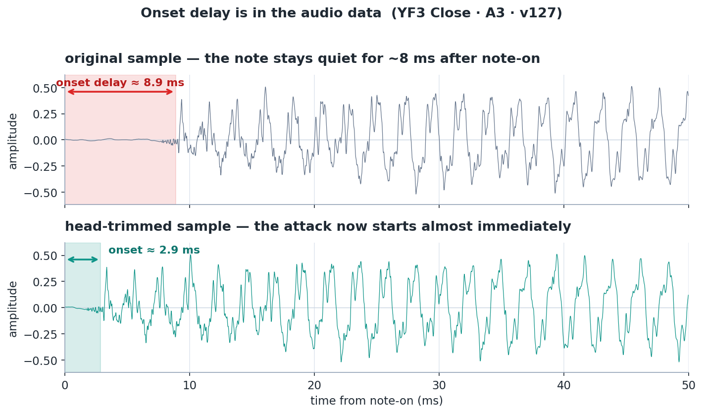
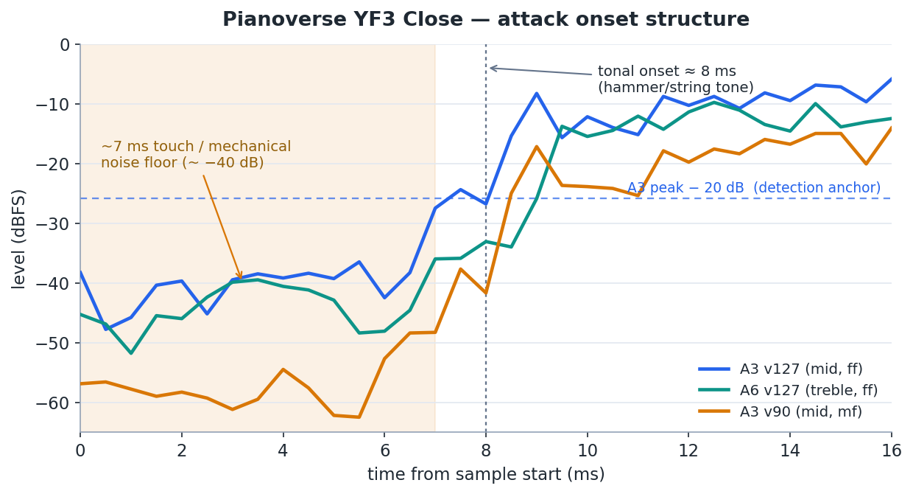
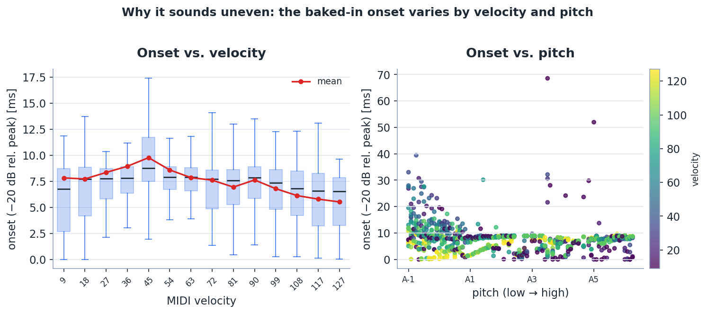
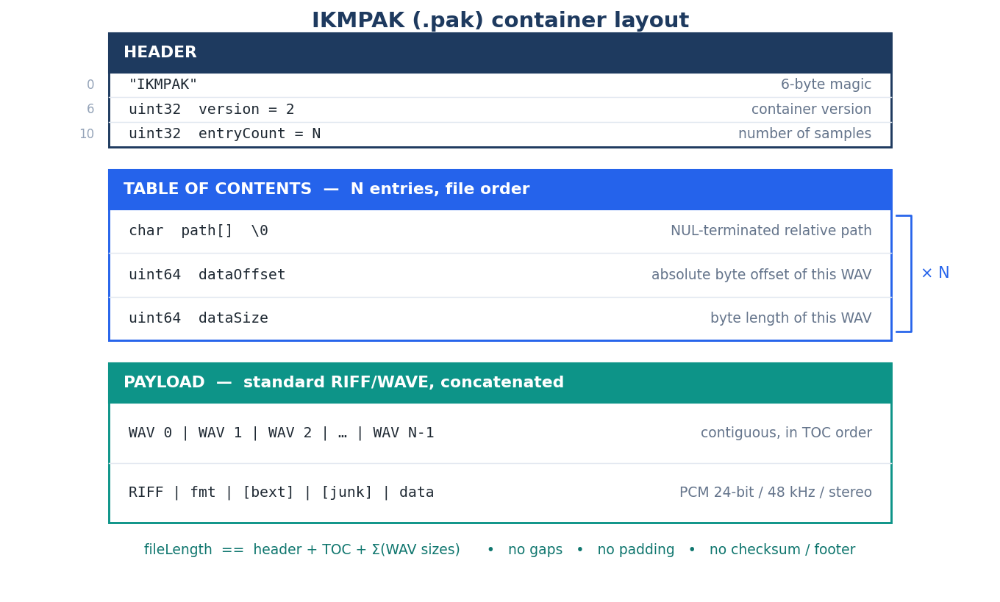
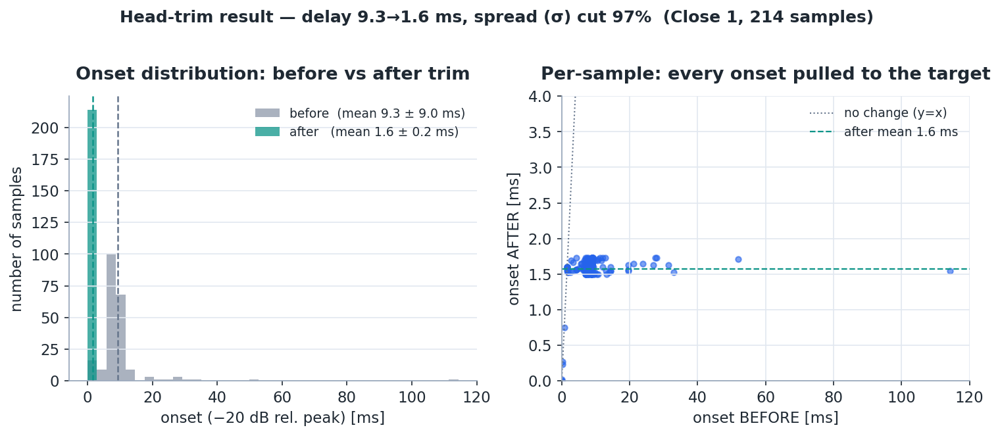
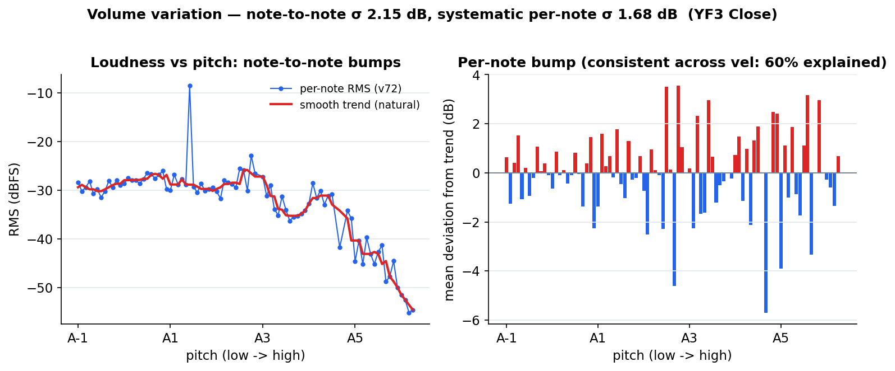

# Pianoverse 発音遅延リサーチ & `.pak` ヘッドトリムツール

IK Multimedia **Pianoverse**（サンプリング・ピアノ音源）の **note-on → 発音までの約8msの遅延**を
**音声データそのもの**から究明し、**サンプルの頭を切り揃えて遅延を最小化＋ばらつきを消す**ための
調査記録とツール一式。

YF3 Close マイクで実測・適用した結果：**発音遅延 9.3 → 2.3 ms（整列した本体は σ 9.0 → 0.27 ms）**、
さらに**音量の系統ばらつき std 1.49 → 0.04 dB**。

> **Disclaimer / 注意**: このリポジトリに **Pianoverse のサンプル音声は一切含まれない**
> （解析コード・計測データ・図のみ）。利用には各自の**正規ライセンス版**が必要。
> 本研究は相互運用・解析目的であり IK Multimedia とは無関係。各自のライセンス/EULA を尊重すること。
> 図は `assets/make_figures.py`（matplotlib）が実測データから生成。
>
> *No Pianoverse sample audio is included here — analysis code, measurements and figures only.
> You need your own licensed copy. Research / interoperability; not affiliated with IK Multimedia.*

---

## 1. 研究目的 / Motivation

- 機械的に一定タッチで打鍵しても、Pianoverse は **note-on から発音まで約8ms** 遅れる。
- これは **オーディオバッファ／ドライバ由来ではなく**「**音声データ由来**」と疑われた。
- Pianoverse のUIには **sample-start / 再生開始オフセット系のコントロールが存在しない**
  （アタックADSRでは中身の位置は動かせない）。→ **プラグイン内では原理的に詰められない。**
- 一方 `.pak`（サンプルコンテナ）は **暗号化されておらず**、中身は標準WAV。
  → **サンプルの頭を切って `.pak` に書き戻せば、Pianoverse のエンジン・プリセット・マイク・
  ベロシティマッピングを一切変えずに、発音遅延だけを詰められる。**

このリポジトリは「(1) 遅延の正体をデータで実証 → (2) `.pak`形式を解析 → (3) 頭出しを揃えて書き戻す」
を再現可能なツールとして残すもの。

---

## 2. 調査結果：発音遅延の正体（データで実証）

対象: `Concert Grand YF3` / **Close マイク** / 全88鍵 × 14ベロシティ（rr1, 1129サンプル, `onset.csv`）。

生波形で見ると、**note-on の後しばらく音が立ち上がらない＝発音遅延がデータに焼かれている**のが一目で分かる
（上=原本は約8ms静か、下=ヘッドトリム後は即発音）:



さらに細かく見ると、各サンプルの先頭は **二段構造**になっている:



- **頭〜約7ms**: −40dBFS前後の低レベルノイズ（タッチ/メカ系）だけ。
- **約7〜9ms**: 打弦トーンが一斉に立ち上がる。高音A6でも7msの床がある＝トーンの立ち上がり遅延ではなく、
  **独立したノイズ前置き**（A6=1760Hz のトーンは本来1ms未満で立つ）。
- → 計測された「8ms」は **バッファでもドライバでもなく、サンプルデータに焼き込まれた構造**。仮説どおり。

### ばらつき（＝「揃わない」原因）



| 指標（窓内ピーク基準の到達時刻） | 平均 | 範囲 |
|---|---|---|
| 最初の音 (−40dB) | ~2ms（実質 t≈0） | 0〜21ms |
| 本体トーン (−20dB) | **7.5ms** | 0.02〜68ms |
| ほぼピーク (−12dB) | 9.6ms | 〜85ms |
| ピーク到達 | 37.7ms | 4.7〜216ms |

- **ベロシティ依存**: 中弱打が最も遅い（mean ~9.5ms @ v36–45 → v127 で ~5.5ms）。
- **ピッチ依存**: 低音ほど遅い（A-1 ≈ 15ms、中高音 ≈ 5〜9ms）。

→ 「究極まで詰める＋ばらつきを消す」には、各サンプルの **発音点を検出して共通の極小プリロールに揃え、
頭を切る**のが正攻法。

---

## 3. `.pak`（IKMPAK）フォーマット仕様

リバースエンジニアリング済み。**暗号化なし**・固定構造。



```
HEADER   off0 "IKMPAK"(6) | off6 uint32 version=2 | off10 uint32 entryCount=N
TOC      （N エントリ・ファイル順）  path\0 | uint64 dataOffset | uint64 dataSize
PAYLOAD  標準 RIFF/WAVE を連結（各: RIFF|fmt(PCM 24bit/48k/stereo)|[bext]|[junk]|data）
```

確認した不変条件（`repack` が依存）:

- `fileLength == header + TOC + Σ(WAVサイズ)`、**末尾チェックサム・隙間・パディング なし**（連結のみ）。
- WAVは **24-bit / 48kHz / stereo PCM**（iZotope RX 書き出し、`bext`/`junk` チャンク付きあり）。
- TOC の `path` は `…/Notes/Close 1/A-1_v127_e0_rr1 DPA CFIII.wav` のようなフルパス。
  ファイル名に **note / velocity(vNNN) / round-robin(rrN) / pedal-env(eN)** が符号化されている。

### なぜ書き戻しても壊れないか（安全性の根拠）

- `.pak` に **チェックサム/フッターが無い**（上記不変条件）。
- **外部のバイトオフセット索引が無い**: `Library Resources/*.pak` = アイコンPNGのみ、
  `Library Info/*.pak` = 約100バイトのメタのみ。
- エンジンは **pak内TOCの「パス」でサンプルを引く**。→ TOCのオフセット/サイズを正しく振り直す限り、
  頭をどれだけ切っても参照は保たれる。
- エンジンはサンプルを **frame 0 から再生**している（だから8msが出る）。→ 頭を切れば素直に発音が前に来る。

> `.pvsp`（プリセット）は `I4TS`+`IKCRYPTO` で**暗号化**され編集不可。だが触る必要はない
> （プリセットは音色/マイク/FX設定のみ。サンプルは `.pak` 側で完結）。

---

## 4. ヘッドトリム・アルゴリズム

各WAVの **知覚的な発音点（onset）を検出し、全サンプルを共通プリロールに揃えて頭を切る。**

```
入力: WAV data chunk（24-bit/48k/stereo PCM）, AnchorDb=-20, PrerollMs=1.5

1. 先頭400msを 0.25ms バケットの短時エンベロープにする  env[k] = max|x|（両ch）
2. peak = max(env)                       # ほぼ無音(peak<-102dBFS)なら onset = なし → トリム0
3. tAnchor = peak * 10^(AnchorDb/20)      # = peak − 20 dB
4. onsetFrame = env[k] >= tAnchor となる最初の k                  ←★ 検出アンカー
5. trimFrames = max(0, onsetFrame − preroll)                      preroll = 1.5ms 相当
6. data 先頭から trimFrames を除去し、RIFF/data サイズを −trimBytes 補正
```

### なぜ「peak−20dB アンカー」なのか（設計メモ：foot方式は棄却）

最初は「ノイズ床からの立ち上がりの根元(foot)」を `peak−45dB` を下回る点として検出したが、**失敗**した:

- 低音は前置きノイズが **peak比で大きい**（A-1 は頭から −33dB、peakが −5dB）→ −45dB床を一度も
  下回らず foot=0 と誤判定 → 8msの遅延があるのにトリム0。
- rr1 と rr2 で検出がバラつき、**揃えるどころか逆効果**（実測: 96/214 が未トリム）。

→ **foot（根元）ではなく、peak相対の固定レベル（−20dB）を最初に跨ぐ点**を発音点とする方式に変更。
これは計測で最も安定していた指標（§2）そのもので、強弱・低高・ラウンドロビン問わずロバストに検出でき、
全サンプルを同じ基準で揃えられる。`PrerollMs` は可変（0.5ms=最大限タイト、2〜3ms=タッチ感を少し残す）。

### リパック（頭以外はロスレス）

`header + 新TOC(パス据え置き・off/size 振り直し) + 連結(トリム済WAV)` をストリーミング書き出し。
各WAVは `fmt/bext/junk/尾部` を完全保持し、**尾部バイトは元と完全一致**（＝頭だけロスレス除去）。
出力は `fileLength == header+TOC+Σ`・隙間0・WAVヘッダ整合を自動検証。

### 仕上げ（`repack.py` / numpy）

3点を追加（ゲインは全サンプルに掛かり PowerShell では遅いので numpy 版に移行）：

- **`--maxtrim` 上限（既定20ms）**: pppp音の切りすぎを防止（§8）。本体は揃えつつ最弱音の自然な遅れを温存。
- **`--fade` フェードイン（既定0.4ms）**: 切り口の段差を消してクリック対策。
- **`--gains note_gains.csv`** ノート固有ゲイン（任意）: 音量のばらつき補正（§7）。

### 結果（YF3 Close 1 = Aの全オクターブ × 14vel × rr、214サンプル）



- **発音遅延 mean 9.3 → 2.3 ms**。
- **整列した本体 207/214 本：σ 9.0 → 0.27 ms**（プリロール1.5msへ収束）。
- 残り **7本の最弱音**（A5 v9, A-1 弱打）は上限capで**自然な遅れを温存**（butcher回避）。
- 検証は `verify_close1.py`（再測定で確認）。

---

## 5. ツール / 使い方（PowerShell + Python）

| ファイル | 役割 |
|---|---|
| `pak.ps1` | `.pak` の TOC パーサ／WAVチャンク解析／onset計測の基盤関数 |
| `onset-sweep.ps1` / `loudness-sweep.ps1` | 発音遅延／音量を一括計測 → CSV |
| **`repack.py`** | **本命**：onset検出＋トリム(cap)＋fade＋ノートゲイン＋IKMPAK書き戻し（numpy） |
| `repack.ps1` | トリムのみの PowerShell 版（参考実装） |
| `assets/make_figures.py` / `analyze_loudness.py` | 実測CSV→研究図(PNG)・`note_gains.csv` 生成 |
| `verify_close1.py` | 前後の onset／音量を再測して検証 |
| `onset*.csv` / `loudness*.csv` / `note_gains.csv` | 計測・補正データ |

```powershell
# 計測（発音遅延・音量）
. .\onset-sweep.ps1    -Paks @("...\Close 1\Close 1.pak") -RrFilter ''
. .\loudness-sweep.ps1 -Paks @("...\Close 1\Close 1.pak") -RrFilter ''
```
```bash
# 図・ノートゲイン表を生成
python assets/analyze_loudness.py
python assets/make_figures.py

# トリム+cap+fade+ゲインで .pak に書き戻し（原本は触らない）
python repack.py "...\Close 1\Close 1.pak" "...\Close 1\Close 1.trim.pak" \
       --preroll 1.5 --maxtrim 20 --fade 0.4 --gains note_gains.csv
```

> **デコード注意**: PowerShellの `-shl` は左オペランドが `[byte]` だと結果も byte に切り詰める。
> 24bit PCM は `[int]$b[$i] + [int]$b[$i+1]*256 + [int]$b[$i+2]*65536` のように **int キャスト後**に合成する。

---

## 6. 適用フロー / ロードマップ

- [x] `.pak`(IKMPAK) フォーマット解析・暗号化なしを確認
- [x] 発音遅延の正体を実証（ノイズ前置き → 約8msでトーン）
- [x] ヘッドトリム・リパックツール（ロスレス検証PASS）
- [x] 音量ばらつき調査＋ノート固有ゲイン補正（systematic 60%、std 1.49→0.04dB）
- [x] 最終パイプライン `repack.py`（trim+cap+fade+gain）で YF3 Close 1 を処理・前後検証
- [ ] Pianoverse で読み込みテスト（差し替え後の試聴・動作確認）← **ユーザー側で実施**
- [ ] 全 Close（1..12）へ展開、必要なら Coincident も
- [ ] preroll / maxtrim / 補正強度の最適値を試聴で決定

### 差し替え手順（要バックアップ）

1. **Pianoverse / DAW を閉じる**（`.pak` のファイルロックを解放）。
2. 原本を退避: `Close 1.pak` → `Close 1.pak.orig`（リネーム）。
3. トリム版を本名に: `Close 1.trim.pak` → `Close 1.pak`。
4. Pianoverse を開いて読み込み確認・試聴。問題あれば `.orig` を戻す。

---

## 7. 音量のばらつき（追加調査）

YF3 Close 全鍵 × 14vel（rr1+rr2, 2258サンプル, `loudness_close_all.csv`）で各サンプルの RMS を計測
（`loudness-sweep.ps1` → `assets/analyze_loudness.py`）。



- **隣接半音の音量差**: median **1.46 dB**、90%点 5.3 dB（同じ強さで弾いても隣の鍵と差がある）。
- 滑らかなトレンドからの**各ノートのズレ σ 2.15 dB**。
- 突出する音: **F5 −5.7dB / F3 −4.6 / A5 −3.9（弱い）**、**F#3 +3.6 / D#3 +3.5 / E6 +3.2（強い）**。
- このズレの **60% は全ベロシティ共通の「ノート固有オフセット」** ＝ **ノート1つにつき1ゲインで6割補正できる**
  （残り4割はベロシティ依存）。
- 一方 **ベロシティ層は全ノート単調**（reversal=0）、**ラウンドロビン不揃いは小**（mean 0.16dB, >1dB は極弱音数本のみ）。

→ ばらつきの本命は **音程間**。`analyze_loudness.py` が各ノートの補正ゲイン（`note_gains.csv`、ヘッドルーム安全・
減衰中心）を出し、`repack.py --gains` で `.pak` に適用。

**検証結果（Close 1 のA音）**: ゲインは全ノートでピタリ命中（ΔRMS ≈ 指定値）。
**ノート固有のズレ std 1.49 → 0.04 dB**（A5 の −3.9dB 弱音 → +3.9dB 補正で residual ≈ 0）。
ベロシティ依存の自然なバラつきは温存。

---

## 8. 既知の課題（セルフレビュー）

- [x] **弱音・高音の切りすぎ** → `--maxtrim 20ms` で解消（`A5 v9` の 112ms 切りを cap、最弱7本は自然な遅れを温存）。
- [x] **切り口のフェード未実装** → `--fade 0.4ms` フェードインを実装、クリック源を除去。
- [ ] **Pianoverse 実機ロードは未検証**（最重要）: フォーマット根拠（チェックサム無し・パス参照）で安全と論証済みだが、
  ランタイム読み込み／キャッシュ検証は未確認（試聴テストはユーザー側）。
- onset のメトリクス窓幅が計測(250ms)とトリム(400ms)で微妙に不一致（影響は軽微）。

---

## 9. 注意 / バックアップ / ライセンス

- **個人利用・解析のみ**。サンプルの再配布や、暗号化(.pvsp)の回避は行わない/対象外。
- 原本は **リネーム退避**でバックアップ。さらにインストーラ（`Pianoverse_*.zip`）から復元可能。
- 本リポジトリは **ローカルのみ**。公開しない。
